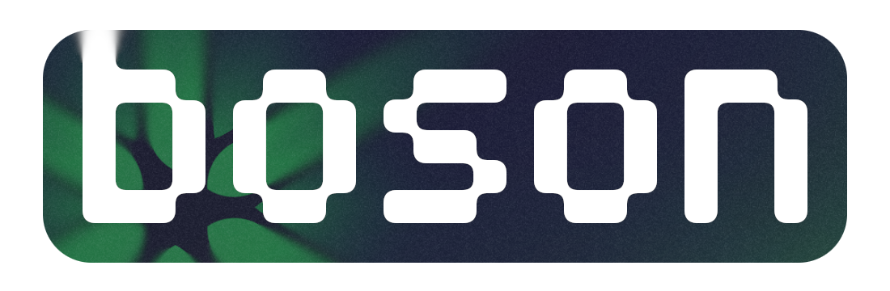

  
   
  A <b>C3 UEFI bootloader</b> for the x86-64 architecture. Made for the <a href="https://github.com/rickyadastra/muon-kernel/">muon kernel</a>.
    
  

## Requirements
- Install [c3c](https://c3-lang.org/getting-started/prebuilt-binaries/#installing-on-ubuntu)
- Install build and run utils with `sudo apt install lld mtools qemu-system-x86`
- Enable KVM[^1] 

[^1]: If you're using WSL2 follow this [guide](https://serverfault.com/a/1115773)

## Getting started
After cloning this repository to your local machine, use `make` to build the bootloader. 
You will find the compiled binary in the `build` folder.
Executing `make run` will compile and run the booloader in a QEMU virtual machine.

> [!IMPORTANT]
> The Makefile is used to minimize command length. The c3c compiler will be run in full trust mode to execute linking and running scripts from the [scripts/](scripts) folder.
